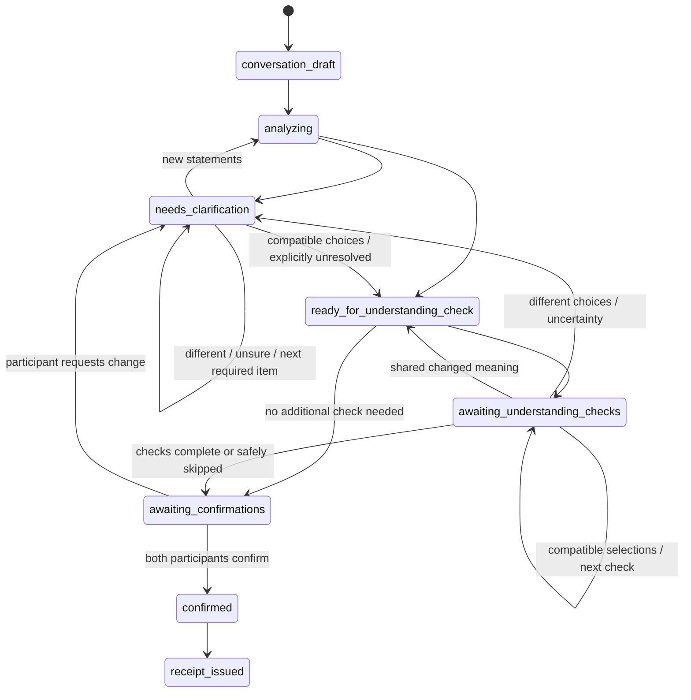

# MeaningSync Architecture

## System Boundaries

Only FastAPI imports the OpenAI SDK or reads `OPENAI_API_KEY`. Live agreement analysis uses the Responses API with Pydantic Structured Outputs, configured timeouts, and `store=False`. Provider failure returns a controlled error; Live never falls back to deterministic fixture output. Question selection, option construction, option validation, and same-device comparison are deterministic application rules and add no model request on the normal path. Demo remains deterministic and key-free.

## User Journey and Guidance Boundary

The browser presents five stable stages—Conversation, Clarify, Check understanding, Confirm, and Receipt. Setup sits before them. `analyzing` is a transient server state during the move out of Conversation, not a user-selectable stage. The finer-grained server lifecycle below remains authoritative.

Each Live session response includes server-derived guidance: user stage, headline and explanation, primary and optional secondary action, acting participant, active question and item, required/optional item keys, and counts. The browser renders this contract; it does not scan question history or term arrays to guess what comes next. Every write still carries the current agreement-version ID and is validated against the lifecycle.

Guidance follows one deterministic priority: scope; amount and price coverage; materials; timing; payment; then other critical responsibility. Stable item order breaks ties. An existing participant-specific follow-up stays active until answered, explicitly carried unresolved, or invalidated by a newer meaningful version. Optional not-discussed details are grouped after required decisions and can be submitted as one deliberate batch.

## Server-Owned Live Lifecycle

FastAPI, not the browser, owns the active participant and valid transitions. Mutations carry the expected agreement-version ID; stale writes receive HTTP 409 with the current version ID. Request IDs make repeated submissions idempotent.

## Versions and Provenance

Each successful analysis or deterministic choice resolution creates a frozen internal snapshot with a unique ID, increasing internal version number, optional parent ID, source message IDs, full evidence-backed map, unresolved keys, not-applicable proposals, model/prompt/schema metadata, and a change summary. Original snapshots stay available for provenance. Clarification answers and added statements become new immutable, speaker-attributed messages; they never rewrite the original conversation.

The UI separately displays a meaningful version number. It increments only when the snapshot's deterministic semantic fingerprint changes. The canonical fingerprint includes normalized item state, participant positions and statuses, evidence-backed missing-to-stated transitions, and mutually acknowledged not-applicable treatment. It excludes neutral-summary wording, IDs, timestamps, request/provider metadata, and other operational noise. A successful retry may therefore create a new immutable internal snapshot while keeping the same visible Agreement Map version and omitting a misleading comparison screen.

Question fingerprints bind the exact semantic target and normalized positions across internal versions. They prevent equivalent open questions from being duplicated; they do not merge distinct atomic agreement items. A server-owned independent-evidence record also prevents a completed clarification item from being repeated during Check understanding. Attempt limits remain a separate protection against clarification loops.

The first selection stays in private persisted session state and is omitted from the public response, page payload, URL, and browser storage until the second addressed participant answers. Clarifications remain bound to the exact item and source version. A resulting explicit statement or changed shared meaning enters the existing immutable version flow. The configurable per-item attempt limit ends loops by preserving the unresolved item for explicit review.

## Check Understanding, Confirmation, and Receipt

Same-device checks progress one question and one participant at a time. The question shows a compact set of neutral meanings derived from trusted agreement data, always including `Something else` and `I'm not sure`. Free text appears only for `Something else`. The UI locks the prior step and hides the first selection during handoff, but this is a presentation boundary—not authentication, identity verification, or strong privacy.

Stable item IDs, semantic commitments, and the independent-evidence record prevent wording-level duplicates and clarification/check repetition. If the current meaning has a completed clarification with independent support from both participants, the question selector caps the remaining Check understanding work at one additional high-impact meaning and may create none. Without clarification, simple agreements prefer one or two questions and broad agreements use at most three. Optional missing topics are excluded unless participants deliberately add, resolve, or acknowledge them. Matching recorded meaning completes the check. Matching alternative meaning creates or reviews a changed agreement version, different meanings reopen only that item, and uncertainty cannot become alignment. Both people may deliberately leave an item unresolved.

Required issues must be resolved or explicitly acknowledged as unresolved before Check understanding. Optional not-discussed topics remain visible under progressive disclosure and may be batched into one additional-statement submission. Continuing unresolved records a decision about status; it never changes the underlying meaning to aligned.

Confirmations bind participant, current agreement version, completion of that participant’s applicable understanding checks, unresolved acknowledgments, language, request ID, and timestamp. A new version invalidates older confirmations. Receipt issuance requires all applicable checks to be completed or deliberately left unresolved and two current confirmations. The receipt preserves every meaning category and uses a SHA-256 hash of its canonical server-side payload to detect changes; the hash is not a digital signature or proof of identity. Neither the choices nor the receipt prove comprehension, consent, or legal enforceability.

## Storage and Recovery

Live workflow state is an explicit Pydantic-validated `state-v1` JSON document behind one `LiveSessionRepository` abstraction. `SqlLiveSessionRepository` stores the document with a monotonic revision, creation/update timestamps, and expiry. Every mutation loads and validates within a transaction and updates only when the expected revision still matches. PostgreSQL is the production recommendation; ignored SQLite is supported for local work and repository tests. `InMemoryLiveSessionRepository` is an explicit deterministic test implementation, never a production fallback.

Analysis uses two transactions: persist `analyzing`, release the database while awaiting OpenAI, then commit only against the expected analyzing revision. Controlled provider failure restores a retryable stage without deleting durable state. Alembic owns schema changes; startup validates connectivity and migration presence rather than calling `create_all()`.

Live sessions and receipts survive backend restarts until `MEANINGSYNC_SESSION_TTL_HOURS` expires. Expired sessions return HTTP 410; automatic row cleanup, backups, and user-facing deletion are not implemented. Demo sessions remain process-local. Persistence does not add authentication or participant privacy: P1A keeps the same-device UI. Role-bound tokens, single-use invitation exchange, QR joining, participant authorization, and lightweight synchronization remain P1B. Audio, multilingual flows, and custom PDF output remain separate work. MeaningSync does not prove identity or consent, provide legal advice, or create a legally enforceable contract.
