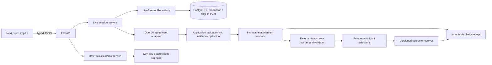
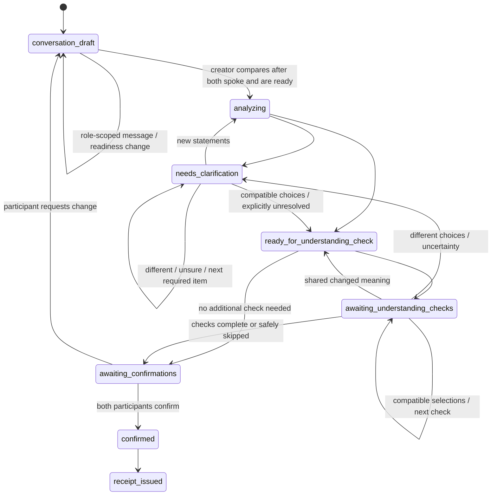

# MeaningSync Architecture

## P1B Separate-Device Boundary

Next.js remains the only browser application and FastAPI the only backend. Setup records independent languages, INR/USD/EUR session metadata, the creator’s Customer/Service provider role, and shared- or separate-device participation. Shared-device creation returns both role credentials; separate-device creation returns the creator credential and an invitation for the opposite role. Next.js renders the QR locally. The join page removes the URL-fragment secret immediately, shows the data notice, exchanges the secret with FastAPI after acceptance, and stores the resulting credential in `sessionStorage`.

Both devices call the same JSON workflow APIs and poll at roughly 1.5 seconds. FastAPI authenticates before loading or mutating Live state, enforces participant ownership, and returns a scoped view with revision and presence. SQL stores session `state-v3`, credential hashes, and invitation hashes in separate tables. OpenAI remains backend-only and is called only by the creator’s explicit, readiness-gated analysis transition.

```text
Host browser ── bearer + JSON ─┐
                              ├── FastAPI ── SQL session/access/invite rows
Worker browser ─ bearer + JSON ┘       └── OpenAI (explicit analysis only)
       ▲
       └── local QR → fragment invite → atomic exchange
```

## System Boundaries



Only FastAPI imports the OpenAI SDK or reads `OPENAI_API_KEY`. Live agreement analysis uses the Responses API with Pydantic Structured Outputs, configured timeouts, and `store=False`. Provider failure returns a controlled error; Live never falls back to deterministic fixture output. Question selection, option construction, option validation, and same-device comparison are deterministic application rules and add no model request on the normal path. Demo remains deterministic and key-free.

## User Journey and Guidance Boundary

The browser presents exactly six stable steps—Preferences, Participation, Conversation, Check understanding, Confirm, and Receipt. A central frontend mapping translates the finer-grained server lifecycle into those labels. `analyzing` is a transient loading state at the start of Check understanding, never a separate step. Clarification is a decision within Check understanding, not a seventh progress step.

Each Live response includes authoritative lifecycle state, viewer/creator roles, participant presence/readiness, active question/item, agreement versions, and confirmations. The browser’s central presentation mapping selects the visible step; it does not duplicate stage interpretation across pages. Every version-sensitive write carries the current agreement-version ID and is validated against the lifecycle.

Guidance follows one deterministic priority: scope; amount and price coverage; materials; timing; payment; then other critical responsibility. Stable item order breaks ties. An existing participant-specific follow-up stays active until answered, explicitly carried unresolved, or invalidated by a newer meaningful version. Optional not-discussed details are grouped after required decisions and can be submitted as one deliberate batch.

## Server-Owned Live Lifecycle



FastAPI, not the browser, owns the active participant and valid transitions. Mutations carry the expected agreement-version ID; stale writes receive HTTP 409 with the current version ID. Request IDs make repeated submissions idempotent.

## Versions and Provenance

Each successful analysis or deterministic choice resolution creates a frozen internal snapshot with a unique ID, increasing internal version number, optional parent ID, source message IDs, full evidence-backed map, unresolved keys, not-applicable proposals, model/prompt/schema metadata, and a change summary. Original snapshots stay available for provenance. Clarification answers and added statements become new immutable, speaker-attributed messages; they never rewrite the original conversation.

The UI separately displays a meaningful version number. It increments only when the snapshot's deterministic semantic fingerprint changes. The canonical fingerprint includes normalized item state, participant positions and statuses, evidence-backed missing-to-stated transitions, and mutually acknowledged not-applicable treatment. It excludes neutral-summary wording, IDs, timestamps, request/provider metadata, and other operational noise. A successful retry may therefore create a new immutable internal snapshot while keeping the same visible Agreement Map version and omitting a misleading comparison screen.

Question fingerprints bind the exact semantic target and normalized positions across internal versions. They prevent equivalent open questions from being duplicated; they do not merge distinct atomic agreement items. A server-owned independent-evidence record also prevents a completed clarification item from being repeated during Check understanding. Attempt limits remain a separate protection against clarification loops.

The first selection stays in private persisted session state and is omitted from the public response, page payload, URL, and browser storage until the second addressed participant answers. Clarifications remain bound to the exact item and source version. A resulting explicit statement or changed shared meaning enters the existing immutable version flow. The configurable per-item attempt limit ends loops by preserving the unresolved item for explicit review.

## Check Understanding, Confirmation, and Receipt

The agreement map first shows Matches, Needs a decision, and Not discussed. Non-missing terms retain transcript evidence. Matching terms need no response. A conflict or one-sided term can open a compact neutral choice derived from trusted agreement data, including `Something else` and `I'm not sure`; free text appears only for `Something else`. Same-device mode uses a participant handoff and separate-device mode enforces the bearer role. The first selection stays hidden until every addressed participant answers.

Stable item IDs, semantic commitments, and the independent-evidence record prevent wording-level duplicates. Compatible choices resolve the item and may create an immutable child version. Different choices do not create agreement and are not immediately repeated: participants can return to Conversation for that item or leave it unresolved. Optional missing topics never block confirmation. There is no mandatory teach-back questionnaire or arbitrary minimum question count.

Conversation re-entry clears readiness, active reviews, and current confirmations. Messages do the same and never call OpenAI; only the creator’s explicit readiness-gated comparison starts analysis. Continuing unresolved records a decision about status and never changes the underlying meaning to aligned.

Confirmations bind participant, current agreement version, unresolved acknowledgments, language, request ID, and timestamp. They are collected separately; one participant never confirms for both. A new message, requested change, or new version invalidates current confirmations. Receipt issuance requires two confirmations of the same current version. The receipt preserves every meaning category plus roles, languages, session currency, evidence currency, session/confirmation times, agreement history, and a SHA-256 hash of its canonical server-side payload. The hash is not a digital signature or proof of identity.

## Storage and Recovery

Live workflow state is an explicit Pydantic-validated `state-v3` JSON document behind one `LiveSessionRepository` abstraction; readers migrate stored v1/v2 documents with safe defaults. `SqlLiveSessionRepository` stores the document with a monotonic revision, creation/update timestamps, and expiry. Every mutation loads and validates within a transaction and updates only when the expected revision still matches. PostgreSQL is the production recommendation; ignored SQLite is supported for local work and repository tests. `InMemoryLiveSessionRepository` is an explicit deterministic test implementation, never a production fallback.

Analysis uses two transactions: persist `analyzing`, release the database while awaiting OpenAI, then commit only against the expected analyzing revision. Controlled provider failure restores a retryable stage without deleting durable state. Alembic owns schema changes; startup validates connectivity and migration presence rather than calling `create_all()`.

Live sessions and receipts survive backend restarts until `MEANINGSYNC_SESSION_TTL_HOURS` expires. Expired sessions return HTTP 410; automatic row cleanup, backups, and user-facing deletion are not implemented. Demo sessions remain process-local. P1B supports both shared-device handoff and separate-device participation. Separate-device sessions use role-bound access records, atomic single-use invitation exchange, locally rendered QR codes, and revision-aware polling; only secret hashes are persisted. These controls authorize a credential, not a person's identity. Audio, multilingual flows, and custom PDF output remain separate work. MeaningSync does not prove identity or consent, provide legal advice, or create a legally enforceable contract.
