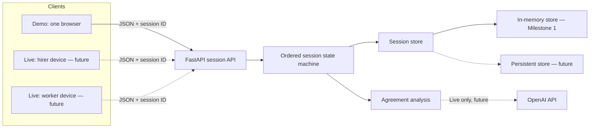

# MeaningSync Architecture

## Product Boundary

MeaningSync compares what two people explicitly said about a service agreement. It is not a contract generator, signature service, identity platform, or general mediation product. A clarity receipt preserves confirmed, conflicting, and missing terms; it never upgrades an inferred term to confirmed.

## Demo and Live Shape

The Next.js client owns presentation and calls FastAPI through a single typed JSON client. Only FastAPI may ever call OpenAI. Demo Mode uses fixed transcript data and deterministic term construction; it makes no OpenAI or audio calls.

## Session Lifecycle

All endpoints are scoped by a generated session ID. The server enforces:

`created → consent_pending → discussion → analyzed → clarification → teachback → confirmation → completed`

Each action permits only the next valid transition. Clarification answers are stored separately by party and the first answer is withheld until both exist. A conflict resolves only when normalized answers are compatible. Both parties must explicitly confirm their teach-back before receipt creation.

## Future Live Mode

Live Mode will reuse the same domain models and session-scoped APIs while allowing two devices to join a session. Separate-device joining, QR presentation, audio capture, durable persistence, and OpenAI-assisted analysis are future concerns and are not implemented in Milestone 1.
