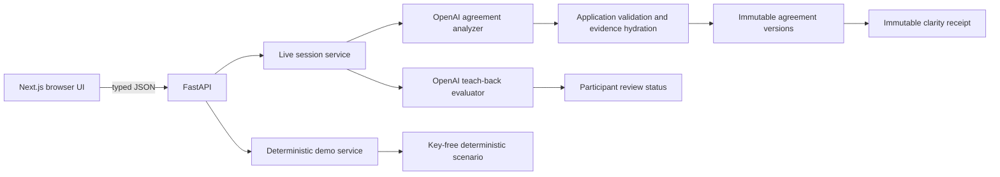
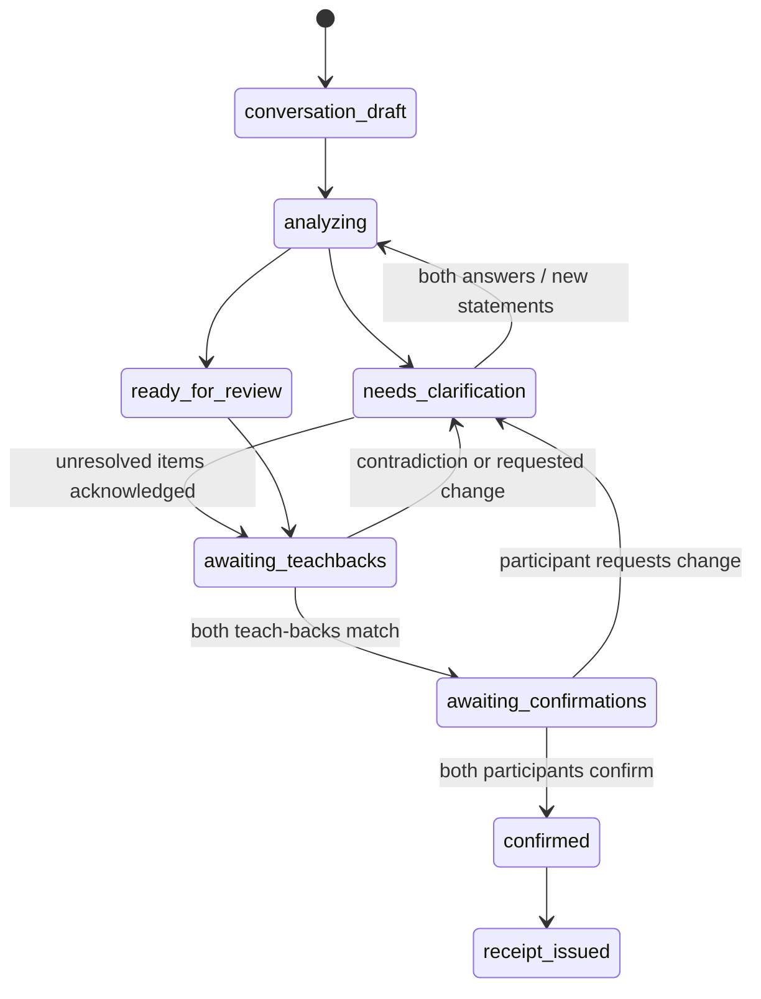

# MeaningSync Architecture

## System Boundaries

Only FastAPI imports the OpenAI SDK or reads `OPENAI_API_KEY`. Live agreement analysis and teach-back comparison use the Responses API with Pydantic Structured Outputs, configured timeouts, and `store=False`. Provider failure returns a controlled error; Live never falls back to deterministic fixture output. Demo remains deterministic and key-free.

## User Journey and Guidance Boundary

The browser presents five stable stages—Conversation, Clarify, Review, Confirm, and Receipt. Setup sits before them. `analyzing` is a transient server state during the move out of Conversation, not a user-selectable stage. The finer-grained server lifecycle below remains authoritative.

Each Live session response includes server-derived guidance: user stage, headline and explanation, primary and optional secondary action, acting participant, active clarification and item, required/optional item keys, and counts. The browser renders this contract; it does not scan clarification history or term arrays to guess what comes next. Every write still carries the current agreement-version ID and is validated against the lifecycle.

Guidance follows one deterministic priority: scope; amount and price coverage; materials; timing; payment; then other critical responsibility. Stable item order breaks ties. An existing participant-specific follow-up stays active until answered, explicitly carried unresolved, or invalidated by a newer meaningful version. Optional not-discussed details are grouped after required decisions and can be submitted as one deliberate batch.

## Server-Owned Live Lifecycle

FastAPI, not the browser, owns the active participant and valid transitions. Mutations carry the expected agreement-version ID; stale writes receive HTTP 409 with the current version ID. Request IDs make repeated submissions idempotent.

## Versions and Provenance

Each successful analysis creates a frozen internal snapshot with a unique ID, increasing internal version number, optional parent ID, source message IDs, full evidence-backed map, unresolved keys, not-applicable proposals, model/prompt/schema metadata, and a change summary. Original snapshots stay available for provenance. Clarification answers and added statements become new immutable, speaker-attributed messages; they never rewrite the original conversation.

The UI separately displays a meaningful version number. It increments only when the snapshot's deterministic semantic fingerprint changes. The canonical fingerprint includes normalized item state, participant positions and statuses, evidence-backed missing-to-stated transitions, and mutually acknowledged not-applicable treatment. It excludes neutral-summary wording, IDs, timestamps, request/provider metadata, and other operational noise. A successful retry may therefore create a new immutable internal snapshot while keeping the same visible Agreement Map version and omitting a misleading comparison screen.

Clarification fingerprints bind the exact semantic target and normalized positions across internal versions. They prevent equivalent open questions from being duplicated; they do not merge distinct atomic agreement items. Attempt limits remain a separate protection against clarification loops.

The first clarification answer stays in private process memory and is omitted from the public response until the second arrives. After both answers, the service appends both messages and re-analyzes once. Clarifications remain bound to the exact item and source version. The configurable per-item attempt limit ends loops by preserving the unresolved item for explicit review.

## Review, Confirmation, and Receipt

Same-device review progresses Homeowner then Electrician. Normal responses omit submitted teach-back text, and the UI locks the prior step, but this is a presentation boundary—not authentication, identity verification, or strong privacy. Live teach-back results can match, partially match, contradict, or be insufficient. A contradiction reopens its exact item; partial or insufficient meaning stays with the active participant and receives a focused follow-up.

Required issues must be resolved or explicitly acknowledged as unresolved before Review. Optional not-discussed topics remain visible under progressive disclosure and may be batched into one additional-statement submission. Continuing unresolved records a decision about status; it never changes the underlying meaning to aligned.

Confirmations bind participant, current agreement version, that participant’s matching teach-back, unresolved acknowledgments, language, request ID, and timestamp. A new version invalidates older confirmations. Receipt issuance requires two current confirmations and two matching teach-backs. The receipt preserves every meaning category and uses a SHA-256 hash of its canonical server-side payload to detect changes; the hash is not a digital signature or proof of identity.

## Storage and Recovery

Demo and Live sessions are process-local only. A browser refresh can reload a session while FastAPI remains alive. A backend restart, worker change, or memory loss makes the session unavailable; the UI must report that truthfully and offer a fresh start. Durable persistence, authentication, separate-device/QR joining, audio, multilingual flows, retention controls, and custom PDF output remain planned. MeaningSync does not provide legal advice or create a legally enforceable contract.
