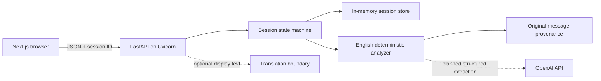

# MeaningSync Architecture

## Implemented System

The Next.js 16 frontend uses one typed JSON client to call FastAPI, served by Uvicorn. The backend owns the session state machine, deterministic agreement analysis, clarification privacy, and clarity receipts. Only the backend may eventually call OpenAI. Current sessions use process-local memory.

The browser path is `/` → `/demo/setup` → `/demo?hirer_language=en&worker_language=en`. The setup route owns independent language selection; the demo route rejects unsupported combinations and passes validated values to `POST /api/v1/demo/sessions`. The existing flow then performs separate consent, deterministic analysis, private clarification, separate teach-back confirmation, and receipt creation. Refreshing `/demo` preserves the selected language values in its URL. FastAPI is configured through `[tool.fastapi] entrypoint = "app.main:app"` and can run with `fastapi dev` or explicit Uvicorn commands.

## Language and Evidence Model

Each session participant independently stores `language` and `requested_display_language` as ISO 639-1 `en` or `hi`. English is the default for both. No pair enum couples the two settings.

Each message retains its session ID, message ID, participant, original text, original language, timestamp, and optional translations keyed by target language. Translation creates display text without replacing original evidence. Each agreement term links back to supporting message IDs, participants, and original statements and carries a confirmation status for both participants.

## Boundaries and Limitations

English ↔ English is fully implemented and never invokes translation. Hindi ↔ Hindi and English ↔ Hindi are represented by the model but their user flows and provider-backed translation are planned. Hindi choices are visible but disabled on demo setup, and Live Mode remains disabled. The eventual Live setup will reuse the same two independent participant-language values. The translation protocol is deliberately small and has no production provider.

Because storage is in memory, restarts lose sessions and multiple Uvicorn workers would diverge; use one process. Planned architecture adds durable persistence, realtime separate-device joining, QR handoff, audio input/playback, and backend-only OpenAI structured extraction. These capabilities are not active today.
