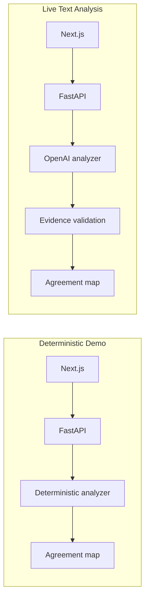

# MeaningSync Architecture

## Implemented Paths

The browser calls one typed JSON API client. Only FastAPI imports the OpenAI SDK or reads `OPENAI_API_KEY`. Both analyzers implement one asynchronous `AgreementAnalyzer` protocol and return the same application-owned contract: atomic topic/facet keys, meaning states, participant positions/statuses, message IDs, hydrated original evidence, and at most one exact-item clarification. Responses distinguish complete, partial-with-warning, and controlled error outcomes.

Demo sessions use process-local storage and the ordered state machine. The deterministic analyzer never needs an API key. Live Text Analysis is stateless per request: `/live` sends two participants and ordered English messages to `POST /api/v1/agreements/analyze`.

## Trust Boundaries

OpenAI receives serialized participant text as untrusted data and returns strict Pydantic Structured Outputs containing message IDs, not authoritative quotations. A clarification question is nested inside its unresolved model term. FastAPI verifies canonical topic/facet keys, atomic-item uniqueness, speaker ownership, both-party support for alignment/conflict, and correct one-sided evidence, then derives the public clarification target and evidence from that owner. Exact original statements are hydrated from the request. Invalid core output returns a controlled error; clarification-only failure returns a partial map without a fabricated question. No fallback fabricates live results, and responses are submitted with `store=False`.

## Status and Limits

Implemented: both paths above, English text input, safe provider errors, and in-memory demo storage. Partially implemented: independent `en`/`hi` participant fields and a translation boundary. Planned: audio/consent, Hindi analysis, translation, separate devices, QR joining, realtime transport, persistence, separate live confirmations, and a live clarity receipt. MeaningSync does not provide legal advice.
